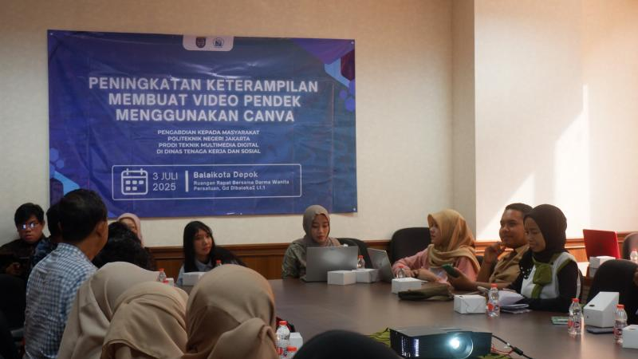
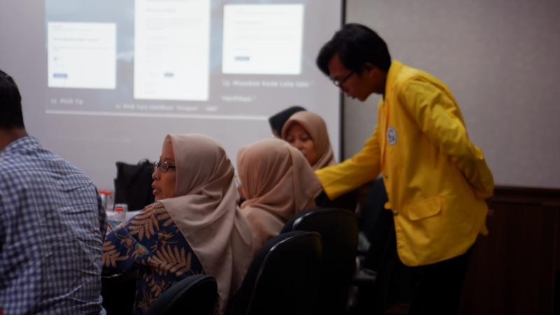
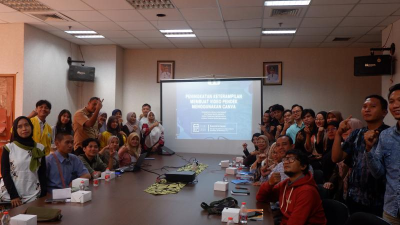

# Repository Pengabdian kepada Masyarakat - Peningkatan Keterampilan Digital untuk UMKM Binaan Disnaker Depok

## Gambaran Proyek

Repository ini berisi seluruh materi dan dokumentasi dari kegiatan **Pengabdian kepada Masyarakat** yang diselenggarakan oleh **Program Studi Teknik Multimedia Digital, Politeknik Negeri Jakarta (PNJ)**. Kegiatan ini merupakan kolaborasi dengan **Dinas Tenaga Kerja (Disnaker) Kota Depok** dan ditujukan untuk meningkatkan keterampilan digital para pelaku UMKM yang merupakan tenaga kerja binaan Disnaker.

-   **Judul Kegiatan:** Peningkatan Keterampilan Digital: Pembuatan Video Marketing dan Website untuk Tenaga Kerja Binaan Disnaker Depok
-   **Tanggal:** Kamis, 3 Juli 2025
-   **Tempat:** Balaikota Depok
-   **Penyelenggara:** Politeknik Negeri Jakarta & Dinas Tenaga Kerja Kota Depok

## Tujuan & Target Kegiatan

Tujuan utama dari kegiatan ini adalah untuk memberikan bekal pengetahuan dan keterampilan praktis kepada para pelaku UMKM agar mampu bersaing di era digital. Pelatihan ini diharapkan dapat membantu peserta untuk:

1.  Memahami konsep dasar **video marketing** sebagai strategi promosi yang efektif.
2.  Mampu membuat konten promosi visual seperti **brosur, postingan media sosial, dan video pendek** secara mandiri menggunakan platform Canva dan Capcut.
3.  Mampu membangun **kehadiran digital (digital presence)** yang profesional melalui pembuatan profil di Google Business dan website sederhana menggunakan Google Sites serta WordPress.

**Target Peserta:**
Peserta pelatihan adalah para pelaku UMKM dan tenaga kerja yang berada di bawah binaan Dinas Tenaga Kerja Kota Depok.

## Materi Pelatihan

Materi pelatihan terbagi menjadi dua modul utama yang dirancang untuk mudah dipelajari oleh pemula.

### 1. Modul Video Marketing (Canva & CapCut)
Modul ini berfokus pada pembuatan aset promosi visual yang menarik untuk meningkatkan pemasaran produk atau jasa.
-   **Pengenalan AI di Canva:** Pemanfaatan fitur-fitur kecerdasan buatan di Canva untuk menghasilkan desain, gambar, dan dokumen secara otomatis.
-   **Praktik Desain di Canva:** Tutorial langkah demi langkah untuk membuat brosur, postingan Instagram, dan Reels Instagram untuk jasa servis elektronik.
-   **Editing Video dengan CapCut:** Pengenalan dasar-dasar video marketing dan panduan praktis menggunakan aplikasi CapCut untuk membuat video promosi pendek yang menarik bagi UMKM.

### 2. Modul Website & Kehadiran Digital (WordPress & Google)
Modul ini memandu peserta untuk membangun fondasi kehadiran digital yang kuat melalui website dan profil bisnis online.
-   **Pembuatan Website dengan WordPress:** Panduan lengkap mulai dari pengenalan, pembuatan akun, instalasi tema, hingga kustomisasi halaman seperti profil, portofolio, dan kontak.
-   **Membangun Profil dengan Google Business:** Langkah-langkah mendaftarkan dan mengoptimalkan profil bisnis di Google untuk meningkatkan visibilitas di pencarian lokal dan Google Maps.
-   **Pembuatan Website dengan Google Sites:** Tutorial membuat website informatif yang terintegrasi dengan ekosistem Google, mulai dari halaman beranda, produk, hingga kontak.

## Hasil

Berikut adalah hasil akhir dari tutorial yang telah diikuti. Website ini dapat dijadikan sebagai referensi dan contoh implementasi dari materi yang diajarkan.

**Website Portofolio (WordPress):**
[https://tutorialwebportfolio.wordpress.com/](https://tutorialwebportfolio.wordpress.com/)

Seluruh aset dan hasil akhir dari proyek ini juga dapat ditemukan di dalam folder `/Hasil` pada repository ini, mencakup desain brosur, postingan Instagram, dan video promosi yang dibuat berdasarkan studi kasus jasa servis elektronik.

## Jadwal Kegiatan

<details>
<summary>Klik untuk melihat detail rundown acara</summary>

**08.00 – 08.15 | Registrasi**

**08.15 – 08.25 | Pembukaan**

**08.25 – 08.30 | Pembacaan Doa**

**08.30 – 08.35 | Indonesia Raya**

**08.35 – 08.40 | Dokumentasi**

**08.40 – 08.50 | Pre-Test**

**08.50 – 09.15 | Sesi 1: Introduction to Video Marketing**

**09.15 – 10.30 | Sesi 2: Canva dan Editing Video**

**10.30 – 11.30 | Praktikum Proyek**

**11.30 – 12.00 | Pengumpulan Proyek**

**12.00 – 13.00 | Istirahat**

**13.00 – 14.00 | Sesi 3: Google Site & Google Business**

**14.00 – 14.45 | Sesi 4: Praktikum pembuatan Website**

**14.45 – 15.00 | Post-Test & Pengumpulan Proyek 2**

**15.00 – 15.15 | Pembagian sertifikat & dokumentasi**

**15.15 – 15.30 | Penutup**

</details>

## Struktur Repository

```
Modul-UMKM/
├── Assets/
├── Hasil/
├── Modul-Canva-Capcut/
├── Modul-Wordpress-Google/
├── Wordpress-Screenshots/
└── archive-ss/
```

-   **`/Assets`**: Berisi aset-aset gambar pendukung untuk modul.
-   **`/Hasil`**: Berisi hasil akhir dari proyek yang dibuat selama tutorial.
-   **`/Modul-Canva-Capcut`**: Berisi modul dan materi presentasi dalam format PDF untuk pelatihan Canva dan CapCut.
-   **`/Modul-Wordpress-Google`**: Berisi modul dalam format PDF untuk materi pembuatan website dengan WordPress, Google Business, dan Google Sites.
-   **`/Wordpress-Screenshots`**: Kumpulan screenshot tampilan website yang telah dibuat pada modul tutorial WordPress.
-   **`/archive-ss`**: Direktori untuk menyimpan arsip screenshot.

## Tim Pelaksana (Narasumber & Perwakilan)

-   **Ibu Malisa Huzaifa, S.Kom., M.T.**: Ketua Pelaksana & Perwakilan _(Politeknik Negeri Jakarta)_
-   **Ibu Noorlela Marcheta, S.Kom., M.Kom.**: Narasumber _(Politeknik Negeri Jakarta)_
-   **Ibu Rizki Elisa Nalawati, S.T., M.T.**: Narasumber _(Politeknik Negeri Jakarta)_
-   **Angga Yusma Prasetia**: TMD Tingkat 4 _(Politeknik Negeri Jakarta)_
-   **Yovan Athaillah S.**: TMD Tingkat 4 _(Politeknik Negeri Jakarta)_
-   **Muhammad Ghisymar**: TMD Tingkat 4 _(Politeknik Negeri Jakarta)_
-   **Safira Zahara Jasmine**: TMD Tingkat 4 _(Politeknik Negeri Jakarta)_
-   **Rifki Setiawan**: TMD Tingkat 3 _(Politeknik Negeri Jakarta)_

## Dokumentasi






